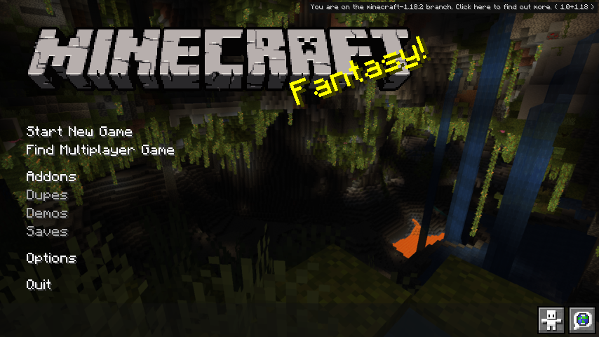

<h1>&nbsp;GMod Title Screen</h1>

Transforms the usual Minecraft title screen into one that looks highly reminiscent of
[Garry's Mod](https://store.steampowered.com/app/4000/Garrys_Mod/)'s title screen. Lightly configurable. Originally taken from a
[personal modpack mod](https://github.com/oatmealine/n3ko-smp-modpack/tree/main/mod).

  
  
  

---

Currently, there is no way to change the backgrounds (at least, without having to abide by the resolution and amount
restrictions), however I plan on implementing it at one point (read: whenever I figure out how to).

Does not come included with a Gravity Gun. Refunds not accepted.# didactic-octo-lamp
# didactic-octo-lamp
# didactic-octo-lamp
# didactic-octo-lamp
